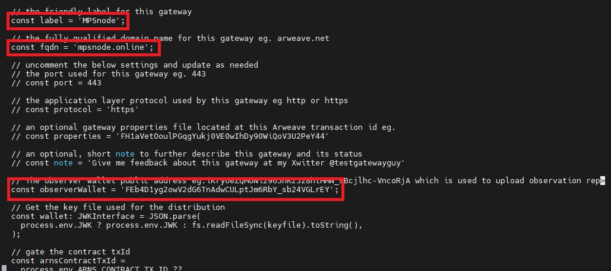
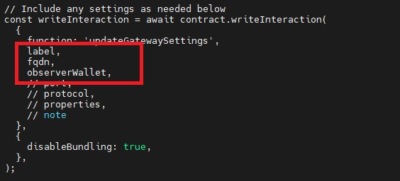

# ar-io-observer-wallet-update
how to renew testnet-contract ar-io ?


## Let's start
### 1. update-gateway-settings.ts

```bash
$ cd ar-io-node/testnet-contract/tools
```
copy the next command

```bash
$ nano update-gateway-settings.ts
```
**change the part I marked, remove the "//" sign, or you can match the photo I marked below.**



**NEXT YOU CHANGE THIS PART TOO, REMEMBER ONLY CHANGE THE PART YOU NEED, REMOVE THE "//" SIGN OR YOU CAN MATCH LIKE THE PHOTO I MARKED BELOW.**




