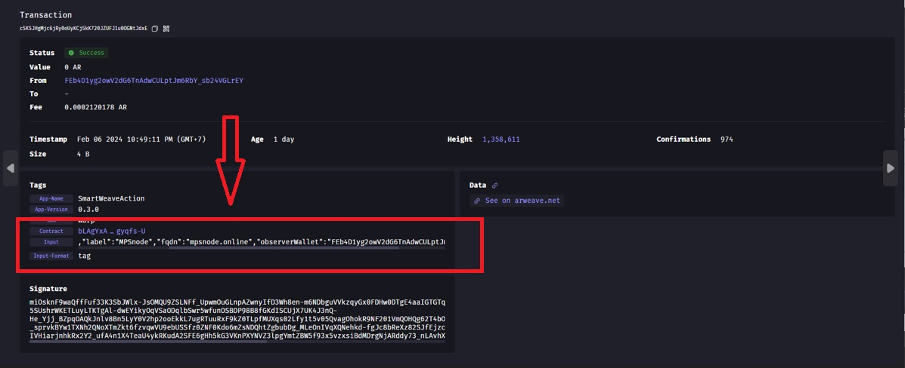

# ar-io-observer-wallet-update
how to renew testnet-contract ar-io ?


## Let's start
### 1. FIRST

```bash
$ cd testnet-contract
```
```bash
$ cd tools
```
copy the next command

```bash
$ nano update-gateway-settings.ts
```
**change the part I marked, remove the "//" sign, or you can match the photo I marked below.**


**NEXT YOU CHANGE THIS PART TOO, REMEMBER ONLY CHANGE THE PART YOU NEED, REMOVE THE "//" SIGN OR YOU CAN MATCH LIKE THE PHOTO I MARKED BELOW.**


**SETELAH SELESAI, CTRL + X, LALU TEKAN ENTER**


### 2. BOTH

then run the following command
```bash
$ yarn ts-node tools/update-gateway-settings.ts
```

IF SUCCESSFUL, there will be info as below.


### 3. THIRD

VISIT THE FOLLOWING LINK:

https://viewblock.io/arweave/tx/


**enter the TX ID you got earlier in the place I marked in the image below.**


**If it looks like below, then everything worked, and you can continue your sleep.**




